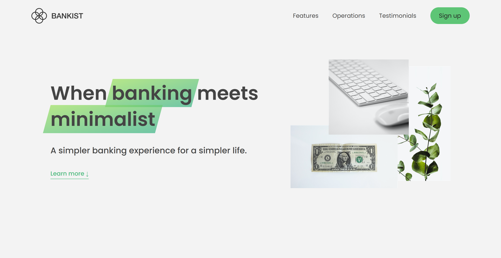
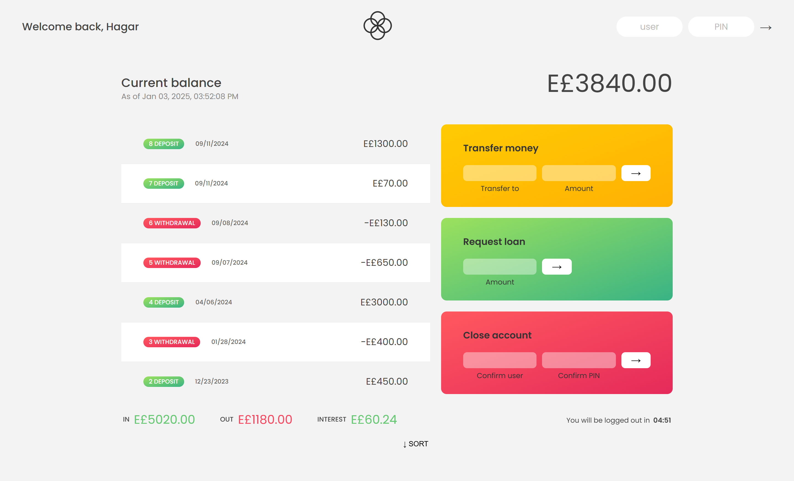
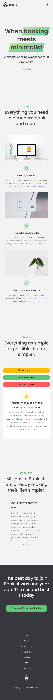
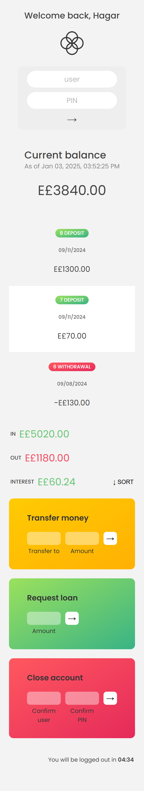

# Bankist

A responsive, front-end banking simulation built with HTML, CSS, and modern JavaScript. Bankist includes a polished landing page and an interactive account dashboard where users can explore common banking workflows such as viewing transactions, transferring money, requesting loans, sorting activity, and closing an account.


## Table of Contents

- [Overview](#overview)
- [Features](#features)
- [Testing Login Data](#testing-login-data)
- [Tech Stack](#tech-stack)
- [Project Structure](#project-structure)
- [Getting Started](#getting-started)
- [How It Works](#how-it-works)
- [Screenshots](#screenshots)
- [Limitations](#limitations)
- [Credits](#credits)

## Overview

Bankist is a client-side web application that demonstrates modern JavaScript DOM manipulation, UI state management, responsive layouts, and browser APIs. The project is split into two experiences:

- A public landing page (`index.html`) with navigation, feature sections, tabbed operations, testimonials, modal signup, lazy-loaded images, sticky navigation, and smooth scrolling.
- A private banking dashboard (`login.html`) with mock account data, transaction history, balance summaries, transfers, loan requests, account closure, localized dates/currencies, and a session countdown timer.

This project is designed as a realistic front-end practice application. It does not connect to a backend, database, or real banking service.

## Features

### Landing Page

- Responsive marketing page for a digital banking product.
- Smooth scrolling between page sections.
- Sticky navigation triggered by the Intersection Observer API.
- Mobile navigation menu.
- Section reveal animations on scroll.
- Lazy-loaded feature images for better perceived performance.
- Tabbed operations component for transfers, loans, and account closing.
- Testimonial slider with arrow, keyboard, and dot navigation.
- Signup modal with overlay and Escape-key close behavior.
- Temporary cookie message rendered dynamically with JavaScript.
- Scroll-to-top control.

### Banking Dashboard

- Mock login flow using predefined demo users.
- Personalized welcome message after authentication.
- Transaction history with deposit, withdrawal, and pending loan states.
- Current balance calculation from account movements.
- Summary values for total income, outgoing payments, and interest.
- Locale-aware date and currency formatting with `Intl`.
- Transfer workflow between demo accounts.
- Loan request workflow with a simple eligibility rule.
- Transaction sorting.
- Account closure confirmation.
- Modal confirmations for sensitive actions.
- Five-minute inactivity countdown that hides the account dashboard.

## Testing Login Data

Use one of the following accounts on `login.html`:

| Owner | Username | PIN | Currency |
| --- | --- | --- | --- |
| Hagar Ragab | `hr` | `1111` | EGP |
| Emma Noah | `en` | `2222` | EUR |
| Steven Thomas Williams | `stw` | `3333` | USD |
| Sarah Smith | `ss` | `4444` | GBP |

Quick testing reference:

```text
username: hr
pin: 1111

username: en
pin: 2222

username: stw
pin: 3333

username: ss
pin: 4444
```

The login form is prefilled with `hr` and `1111` for quick testing.

## Tech Stack

- HTML5
- CSS3
- Vanilla JavaScript
- Browser APIs:
  - DOM API
  - Events
  - Intersection Observer API
  - Internationalization API (`Intl`)
  - Timers (`setInterval`, `setTimeout`)

No build tools, frameworks, or package managers are required.

## Project Structure

```text
Bankist-App/
|-- assets/
|   |-- css/
|   |   |-- login.css
|   |   `-- style.css
|   |-- images/
|   |   |-- logo.png
|   |   |-- logo-name.png
|   |   |-- hero.png
|   |   `-- ...
|   `-- js/
|       |-- login.js
|       `-- script.js
|-- design/
|   |-- bankist-home.jpg
|   |-- account-management.jpg
|   |-- home-web.png
|   |-- home-mob.png
|   |-- login-web.png
|   `-- login-mob.png
|-- index.html
|-- login.html
|-- readme.md
`-- .prettierrc
```

## Getting Started

Because this is a static front-end project, you can run it directly in the browser.

### Option 1: Open the HTML file

Open `index.html` in your browser to view the landing page.

### Option 2: Use a local server

If your editor provides a local server, such as the VS Code Live Server extension, run the project from the repository root and open:

```text
http://localhost:5500/index.html
```

Then use the signup modal or navigate directly to:

```text
http://localhost:5500/login.html
```

## How It Works

### Usernames

Usernames are generated from each account owner's initials. For example, `Hagar Ragab` becomes `hr`.

### Transactions

Each account stores an array of movement objects. A movement includes:

- `amount`: positive values are deposits and negative values are withdrawals.
- `date`: ISO date string used for transaction date formatting.
- `movStatus`: optional status used for pending loan transactions.

### Transfers

Transfers are only allowed when:

- The recipient account exists.
- The recipient is not the current account.
- The transfer amount is greater than zero.
- The current account has enough balance.

When a transfer is confirmed, the app adds a withdrawal to the current account and a deposit to the recipient account.

### Loans

A loan can be requested when the account has at least one deposit worth 10% or more of the requested loan amount. Approved loans are displayed as pending first, then added to the account after a short delay.

### Session Timer

After login, a five-minute countdown starts. Banking actions such as transfers and loan requests reset the timer. When time runs out, the dashboard is hidden and the user must log in again.

## Screenshots

### Desktop




### Mobile




## Limitations

- Data is stored in JavaScript memory only and resets when the page reloads.
- There is no backend authentication, database, or API integration.
- The signup form is a UI demonstration and does not submit real data.
- This application is for learning and portfolio use only; it is not a production banking system.

## Credits

The Bankist concept and original learning project are associated with Jonas Schmedtmann's JavaScript course. This repository documents and presents the project as a portfolio-ready front-end banking simulation.
