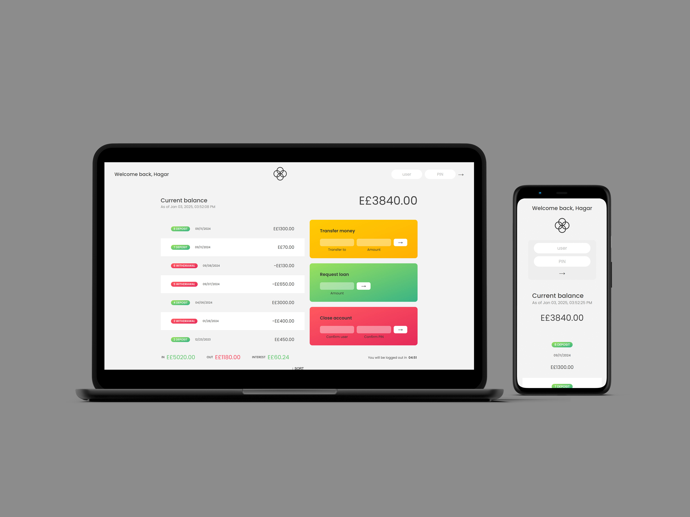

# **Bankist: Banking Web Application**

**Live demo** [click here](https://bankist-banking-management.netlify.app/)

> ### **Description:**

Bankist is a simulation for a modern banking web application built with Native JavaScript. It features a multipage design, with a professional home page and a login page for user account management. The application uses functional programming principles and includes performance optimizations like lazy loading to enhance user experience.

---

> ### **Key Features:**

#### **Home Page:**

- **Multiple Sections:**
  - **Features:** Highlights the main offerings of the bank.
  - **Operations:** Explains how the banking services work.
  - **Testimonials:** Showcases customer feedback and success stories.
  - **Sign Up:** Encourages new users to create an account.

#### **Login Page:**

- **Account Access:**

  - Users can log in to view and manage their accounts.

- **Account Management Features:**
  - **Transaction History:** Displays a detailed list of all transactions, including dates and amounts.
  - **Money Transfer:** Allows users to transfer money securely to other accounts.
  - **Loan Requests:** Users can apply for loans directly through the interface.
  - **Account Closure:** Provides an option to close an account with ease.

---

> ### **Technical Architecture:**

1. **Functional Programming (FP):**

   - Code is structured using pure functions, immutability, and first-class functions for better readability and maintainability.

2. **Performance Optimization:**
   - **Lazy Loading:** Optimizes page loading times by deferring the loading of images and heavy assets until needed.

---

> ### Tech stack:

`HTML` - `CSS` - `JavaScript`

---

> ### **Goals:**

Bankist is a professional-grade application that combines clean, functional code with cutting-edge performance enhancements, delivering an exceptional experience for users to manage their banking needs.
